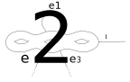

# Tropical2020
Classifying Tropical Surfaces Research Summer 2020 - CU Boulder

## Contents:

1. [Introduction](#Introduction)
2. [Testing](#Testing)
3. [Basic Families](#BasicFamilies)
4. [Piecewise Linear Functions](#SPLFs)
5. [Moduli Spaces](#ModSpaces)
6. [General Families](#Families)

## Introduction <a name="Introduction"></a>

### What is the code, and how to use it:

The code for this project is divided into separate files, each for different classes that implement objects from the 
overleaf document.

The different files and their associated classes/purposes are:

- `CombinatorialCurve.py`: Vertices, Edges, Legs, and Basic Families.
- `GraphIsoHelper.py`: Provides convenience functions for testing if two graphs are isomorphic.
- `StrictPiecewiseLinearFunction.py`: Piecewise Linear functions over Basic Families.
- `ModuliSpaces.py`: Tropical Moduli spaces.
- `RPC.py`: Abstract Monoids.
- `Families.py`: Arbitrary Families and Piecewise Linear functions over a Family.
- `tests.py`: Tests for most things. This file is a good place to see how things are used.
- `generateAndSaveModuliSpace.py`: A short script to generate and save a Moduli Space as specified by command line
arguments.

## Testing <a name="Testing"></a>

The `tests.py` file contains tests that give strong evidence to the correctness of the rest of the program. This is
accomplished in two ways. First, several testing classes have been written (e.g., `CurveTests` and `TreeTests`). Next,
these tests are applied to various examples, most of which come from the reference document. For example, 
here is example 3.5:

    C = BasicFamily("Example 3.5")
    
    M = Monoid()
    M.addgen("a")
    alpha = M.Element({"a": 1})

    v1 = vertex("v1", 0)
    v2 = vertex("v2", 0)
    v3 = vertex("v3", 1)
    e1 = edge("e1", alpha, v1, v2)
    e2 = edge("e2", alpha, v2, v3)
    e3 = edge("e3", alpha, v1, v3)
    e4 = edge("e4", alpha, v1, v1)
    l = leg("l", v1)

    C.monoid = M
    C.addEdges({e1, e2, e3, e4})
    C.addLeg(l)

For an example test, one can execute `CurveTests.testCore(C)` to ensure that the core of `C` is connected and has the
same genus. One can also verify a basis of loops of `C` with 
`TreeTests.verifyLoops(C, {frozenset({e4}), frozenset({e1, e2, e3})})`.

## Basic Families <a name="BasicFamilies"></a>

1. [Vertices](#vertices)
2. [Edges](#edges)
3. [Legs](#legs)
4. [Combinatorial Curves and Basic Families](#basFam)
5. [Morphisms of Basic Families](#famMorphClass)

Vertices, Edges, Legs, Combinatorial Tropical Curves, and Basic Families of curves are implemented in 
`CombinatorialCurve.py`.

### Vertices <a name="vertices"></a>

The `vertex` class represents the vertices of a curve. Initializing a `vertex` requires a name (`string`) 
and a genus (`int`). Initializing or setting negative genus will raise a `ValueError`.

As an example, to initialize a vertex with name "v1" of genus one, one would write the following code:

    v1 = vertex("v1", 1)

### Edges <a name="edges"></a>

The edges are similar to the vertices, as you may have already guessed.
To initialize an `edge`, provide a `string` name, a `Monoid.Element`, a source `vertex`, and a target `vertex`.
For self-edges on the curve, you can input the same vertex for both positions.

For example, suppose `alpha` is some monoid element and `v1` and `v2` are vertices. Then an edge of length `alpha` from
`v1` to `v2` can be initialized as follows:

    e1 = edge("e1", alpha, v1, v2)
    
The `edge` class also has the following members:

- `length`: The length of the edge.
- `vertices`: A set containing the vertices that the edge connects.

### Legs <a name="legs"></a>
A `leg` is initialized only with its name (`string`) and root (`vertex`), making it the simplest class in the file.

For example, to create a leg with name `"l1"` with root `v1`, one can write the following code:

    l1 = leg("l1", v1)

Like an `edge`, a `leg` has the `vertices` property. The `vertices` of a leg consist of the singleton set containing its
root.

### Combinatorial Curves and Basic Families <a name="basFam"></a>

The `BasicFamily` class provides an implementation both for combinatorial
tropical curves and basic families of tropical curves. The difference between these two interpretations is the monoid
that one provides to the class. In order to use a `BasicFamily` as a combinatorial tropical curve, use a free monoid with
one generator. For example, to create a three-element chain `v1--v2--v3` with the left edge of length one and right edge
of length two, one could write the following:

    # Initialize vertices
    v1 = vertex("v1", 0)
    v2 = vertex("v2", 0)
    v3 = vertex("v3", 0)
    
    # Set up a free monoid with one generator
    M = Monoid()
    M.addgen("a")
    alpha = M.Element({"a": 1})
    
    # Edges whose lengths depend on the generator alpha
    e1 = edge("e1", alpha, v1, v2)
    e2 = edge("e2", 2 * alpha, v2, v3)
    
    # Initialize the curve
    C = BasicFamily("A particular chain with three elements")
    C.addEdges({e1, e2})

One can also use `BasicFamily` to represent a basic family of curves. To represent the family of three-element chains
whose edge lengths vary freely over 
the nonnegative real numbers, we simply use a different monoid.
Since we want two edge lengths to vary independently, we use a free monoid with two generators, and let the edge length
of each each to be one of the generators. Here is the full example:

    # Initialize vertices
    v1 = vertex("v1", 0)
    v2 = vertex("v2", 0)
    v3 = vertex("v3", 0)
    
    # Set up a free monoid with two generators
    M = Monoid()
    M.addgen("a")
    M.addgen("b")
    alpha = M.Element({"a": 1})
    beta = M.Element({"b": 1})
    
    # Edges whose lengths are one of the generators
    e1 = edge("e1", alpha, v1, v2)
    e2 = edge("e2", beta, v2, v3)
    
    # Initialize the curve
    C = BasicFamily("Family of all chains with three elements")
    C.addEdges({e1, e2})

The difference between a `BasicFamily` representing a particular curve or a basic family of curves is largely semantic.
The first example also represents the family of all three-element chains where one edge is twice as long as the other.
That being said, there are some members of the `BasicFamily` class which may only make sense when using the curve
interpretation. These members may not be preserved under setting an edge length to zero:

- `bettiNumber` (but not `genus`)
- `degree`, `edgeDegree`, and `legDegree`
- `getEndpointsOfEdges`
- `vertexCharacteristicCounts` and other characteristic functions.
- `checkIfBijectionIsIsomorphism` and other isomorphism functions.
- `spanningTree` and loop functions.
    
### Morphisms of Basic Families <a name="famMorphClass"></a>

A `BasicFamilyMorphism` is a morphism of basic families. It has a domain and codomain, both of which are basic families.
It also has a morphism of curves and a morphism of monoids.

There are many restrictions on the values used to initialize a `BasicFamilyMorphism`. These restrictions are in place to
ensure that an instance of `BasicFamilyMorphism` actually is a morphism of the given basic families. The restrictions
can be found in the reference sheet.

A `BasicFamilyMorphism` takes a domain `BasicFamily`, codomain `BasicFamily`, a dictionary that determines the 
morphism on the domain family, and a `MonoidHomomorphism`. The dictionary should have the vertices, edges, and legs
of the domain curve as its keys, and their images under the morphism as its values.

#### Example <a name="basicFamilyMorphismExample"></a>

As an example, we will build a particular contraction. For our domain curve, we will use the basic family of all
chains with two edges, and for our codomain curve, we will use the basic family of all chains with a single edge. The
morphism will be the contraction of the second edge of the domain curve.

First, we define our families:

    # Free monoid on 2 generators
    m = Monoid()
    m.addgen("a")
    m.addgen("b")
    alpha = m.Element({"a": 1})
    beta = m.Element({"b": 1})
    
    # Basic family of all chains with two edges
    v1, v2, v3 = vertex("v1", 0), vertex("v2", 0), vertex("v3", 0)
    e1, e2 = edge("e1", alpha, v1, v2), edge("e2", beta, v2, v3)
    domainFamily = BasicFamily("domain")
    domainFamily.addEdges({e1, e2})
    
    # Basic family of all chains with a single edge
    w1, w2 = vertex("w1", 0), vertex("w2", 0)
    f = edge("f", alpha, w1, w2)
    codomainFamily = BasicFamily("codomain")
    codomainFamily.addEdge(f)

Next, we can define the morphism dictionary. We will contract `e2` to `w2` and map `e1` to `f`:

    morphismDictionary = {e1: f, e2: w2, v1: w1, v2: w2, v3: w2}

Then we define the corresponding monoid homomorphism. We should fix the first generator of the monoid and contract the
second:
    
    monoidHom = MonoidHomomorphism(m, m, {"a": alpha, "b": m.zero()})

Finally, we can define the morphism of basic families:

    basicFamilyMorphism = BasicFamilyMorphism(domainFamily, codomainFamily, morphismDictionary, monoidHom)

## Piecewise Linear Functions <a name="SPLFs"></a>

1. [Creating a Function](#splfUsage)
2. [Well - Definedness](#splfDefined)
3. [Checking if Your Function is a Mesa](#splfMesa)

### Creating a Function <a name="splfUsage"></a>

A `PiecewiseLinearFunction` is initialized with its domain (`BasicFamily`) and its slope information (and optional
value information). The slope information is a dictionary whose keys consist of all of the edges and legs of the domain
as well as some number of vertices of the domain. The values of this dictionary at a particular key
are interpreted as follows:

- If the key is an edge, then the value is the slope of the function from the first vertex of the edge to the second.
- If the key is a leg, then the value is the slope of the function away from the root of the leg.
- If the key is a vertex, then the value is the actual value of the function at that vertex.

If no vertices are provided, then the initialized function may not be what is expected. It will, however, be a function
with the correct potential.

Let `C` be the curve from example 3.5 of the reference document (shown [here](#Testing)).

```
dict = {e1: 1, e2: 0, e3: 1, e4: 0, l: 0, v1: M.zero()}

f = StrictPiecewiseLinearFunction(C, dict)
```

The function `f` will have value `M.zero()` at vertex `v1`, and value `alpha` at both `v2` and `v3`.

If the given dictionary of slopes and values does not yield any well defined function, then an error will be thrown
during initialization.

### Well - Definedness <a name="splfDefined"></a>

An assignment of slopes to edges does not necessarily yield a well-defined function. This is because there may be
multiple paths between two vertices, so different values may be attained at the same vertex. In fact, an assignment
of slopes will define a function if and only if the path integral of the slopes over every loop is zero.

To test well definedness, we integrate the slopes over a basis of loops of the space. If any of these integrals is
nonzero, then an error is thrown. The function in which this calculation takes place is `assertIsWellDefined`.

### Checking if Your Function is a Mesa <a name="splfMesa"></a>

We now come to one of the most important parts of the PLF class, which is an attempt to answer the age old question 
that has plagued thinkers from all tropics of tropical geometry, is this PLF a mesa?

In the class, we have the property `mesaTest` which will do exactly that. Calling `f.mesaTest` will test the mesa
conditions (as defined in the reference sheet) and return `True` or `False` depending on whether or not the conditions
are met.

## Moduli Spaces <a name="ModSpaces"></a>

1. [Basic Usage](#modSpaceUsage)
2. [Members of `TropicalModuliSpace`](#modSpaceMembers)
3. [Generating the Strata](#modSpaceStrataGen)
4. [Generating the Contraction Dictionary](#modSpaceContractionGen)
5. [Saving and Loading Spaces](#modSpaceIO)

### Basic Usage <a name="modSpaceUsage"></a>

The class `TropicalModuliSpace` found in `ModuliSpaces.py` is meant to represent the 
tropical moduli spaces .
To initialize this class, an integer for the genus and marking of the moduli space must be provided. Since generating 
certain moduli spaces is very time-consuming, the generation of the space does not occur at initialization. Instead, 
a separate function call is used. For example, to generate 
 and track the time to 
generate the space, one could write the following code:

    import time
    
    m = TropicalModuliSpace(1, 5)
    
    start_time = time.time()
    m.generateSpaceDFS()
    end_time = time.time()
    
    print("Generation time:", end_time - start_time)
    
Once the moduli space has been generated, one can call `m.generateContractionDictionary()` to find what curves are
contractions of others.

If execution time is not a concern, then the full generation of 
 consists of calling the
following three lines of code:

    m = TropicalModuliSpace(g, n)
    m.generateSpaceDFS()
    m.generateContractionDictionary()
    
### Members of `TropicalModuliSpace` <a name="modSpaceMembers"></a>

- `curves`: A `Set[BasicFamily]` to store the strata of the space.
- `curvesDict`: A `Dictionary[Int, BasicFamily]` organizing the strata by their number of edges.
- `contractionDict`: A `Dictionary[BasicFamily, List[(Edge, BasicFamily)]]` recording the contraction information of the
space. Given a curve `C`, `contractionDict[C]` is a list of elements of the type `(Edge, BasicFamily)`. 
An element `(e, C')` belongs to `contractionDict[C]` if and only if the weighted edge contraction `C/{e}` is
isomorphic to `C'` and `C'` belongs to the space.

### Generating the Strata <a name="modSpaceStrataGen"></a>

In order to generate the strata of the moduli space, use the function `generateSpaceDFS`. This function first adds the 
unique `n`-marked stable curve of genus `g` with zero edges to the `curves` member. Then, the program examines which 
strata can be specialized, and adds these specializations to `curves` if they are novel (up to isomorphism). The 
specializations are produced in two ways: by splitting and genus-reducing vertices. These two processes are described
below and together generate all specializations.

This process is performed in a depth-first manner: As soon as a curve `C` is specialized to another curve `C'`, the
specializations of `C'` are generated.

#### Splitting Specialization

One way that curves are specialized is by splitting vertices. Given a vertex `v` of curve `C`, a nonnegative
 integer partition
`(g1, g2)` of the genus of `v`, and a partition `(S, T)` of the
endpoints of edges at `v`, a specialization of `C` can be constructed as follows. First, delete vertex `v` and 
add two vertices `v1` and `v2`. Let the genus of `v1` be `g1` and let the genus of `v2` be `g2`. Connect each
endpoint in `S` to `v1` and each endpoint in `T` to `v2`. Finally, add an edge from `v1` to `v2`.

For example, consider the following portion of a tropical curve. A single genus-3 vertex and some connecting edges are
displayed.



In order to partition the genus of this vertex, let `g1=2`, `g2=1`. To partition the endpoints of edges, 
let `S` contain
the connected endpoint of `e2` and the first endpoint of `e1`. Accordingly, let `T` contain the connected endpoint of
`e3`, the second endpoint of `e1`, and the root of `l`. The result is displayed below:


The idea behind this type of specialization is to split a vertex into two pieces and distribute its data among those
pieces.

In order to preserve stability, there are some restrictions on `g1`, `g2`, `S`, and `T`. If `g1=0`, then `S` must
contain at least two elements. Otherwise, after splitting, a vertex of genus zero would have degree less than three.
Similarly, if `g2=0`, then `T` must have at least two elements.

#### Genus Reduction Specialization

Another way that curves are specialized is by reducing the genus of vertices. Given a vertex `v` of a curve `C`, a
specialization of `C` can be produced in the following manner as long as `v` has genus at least one. To produce the
specialization of `C`, simply reduce the genus of `v` and introduce a new edge connecting `v` to itself. Taking the 
same example as was used for the splitting specialization, consider the following portion of a curve:


This vertex has positive genus, so we can reduce the genus and introduce a new loop:


As with splitting specialization, this type of specialization does not necessarily preserve stability. The one case 
where stability is not preserved is when `v` is a vertex with genus one and degree zero. If this vertex were
genus-reduced, it would become a vertex with genus zero and degree two.

### Generating the Contraction Information <a name="modSpaceContractionGen"></a>

In order to generate the contraction dictionary of the moduli space, use the function `generateContractionDictionary`.
For each curve `C` in the space, and for each edge `e` of `C`, this function identifies which curve of the space is
isomorphic to the weighted edge contraction `C/{e}`.

### Saving and Loading Spaces <a name="modSpaceIO"></a>

In order to load a moduli space from a file, initialize the space with proper genus and marking number, and then call 
`loadModuliSpaceFromFile(filename)`. To save a space, call `saveModuliSpaceToFile`. Both functions accept delimiter
and encoding information. By default, the curve entry delimiter is `=` and the encoding is `utf-8`. 
`saveModuliSpaceToFile` accepts an optional filename to save to. If none is provided, a filename is automatically
generated based on the genus and marking of the space.


## General Families <a name="Families"></a>

1. [Basic Usage](#famBasicUsage)
2. [Classes](#famClasses)

### Basic Usage <a name="famBasicUsage"></a>

### Classes <a name="famClasses"></a>

The classes are as follows:
- [Family](#familyClass): Represents a family of tropical curves.
- [PLFFamily](#plfFamily): Represents a piecewise linear function over a family.

#### `Family` <a name="familyClass"></a>

A `Family` consists of a collection of basic families and a collection of morphisms between those basic families.

Methods:

- `getAncestors`: Given a basic family `C`, returns the set of all ancestors of `C`. A basic family `F` is an ancestor
of `C` iff the class possesses a morphism from `F` to `C`. 
- `getMaximalCurveIter`: Returns an iterator of all curves / basic families which are not a proper contraction of
another curve in the family.

##### Example <a name="familyExample"></a>

Consider the morphism and basic families defined in [this example](#basicFamilyMorphismExample). This example already
has the structure of an abstract family. To collect the structure into a single class, we can write the following:

    myFamily = Family({domainFamily, codomainFamily}, {basicFamilyMorphism})

This family consists of two basic families and a single morphism between them.

#### `PLFFamily` <a name="plfFamily"></a>

A `PLFFamily` represents a piecewise linear function over a family. To initialize a `PLFFamily`, provide a `Family` and
a dictionary whose keys are the basic families of the given family, and whose values are PLFs on those basic families.

Not every assignment of a PLF on the basic families determines a PLF over the entire family. The issue is that the
basic PLFs must be preserved under pushforwards by morphisms of the family. During initialization, it is checked that
this condition (and others) are met. If they are not met, then an error is thrown.

##### Example

Let's define a `PLFFamily` over the `Family` defined [here](#familyExample) with basic families and morphisms coming
from [here](#basicFamilyMorphismExample). Recall that the basic families consist of the family of all chains with 2
edges and the family of all chains with a single edge. Only one morphism of basic families is included, and that is
the morphism from the 2-edge chains into the 1-edge chains which contracts the second edge.

We are free to define any PLFs which are preserved under this contraction. For example, consider the following:

    domainPLF = PiecewiseLinearFunction(domainFamily, {e1: 1, e2: -1, v1: m.zero()})
    codomainPLF = domainPLF.getPushforward(basicFamilyMorphism)

Here, we define a simple PLF on the 2-edge chains, and then push it forward along the only morphism of the family. This
will guarantee that our choices of PLFs are consistent with each other. To define the PLF over the family, we simply
execute:

    myPLFFamily = PLFFamily(myFamily, {domainFamily: domainPLF, codomainFamily: codomainPLF})
